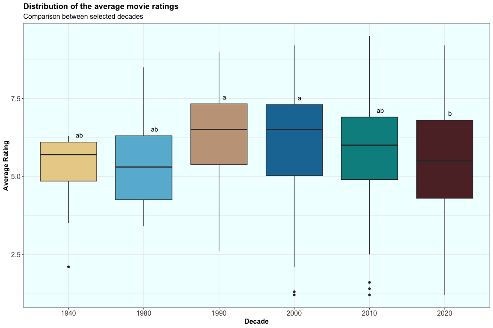
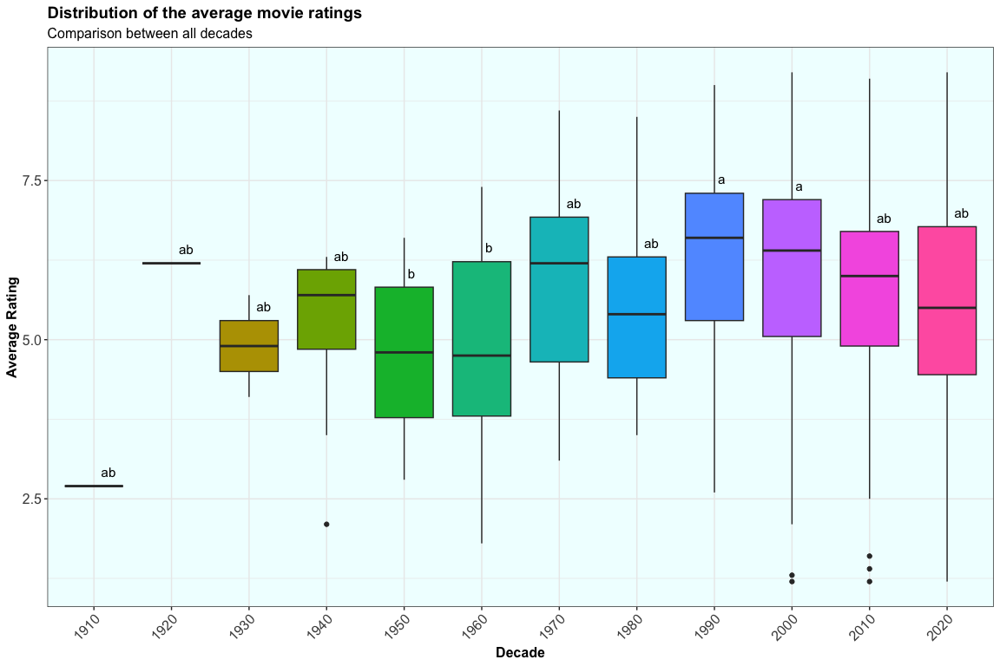
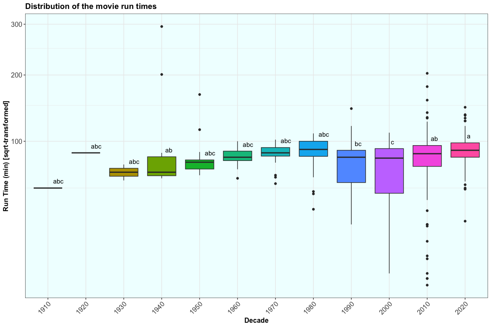
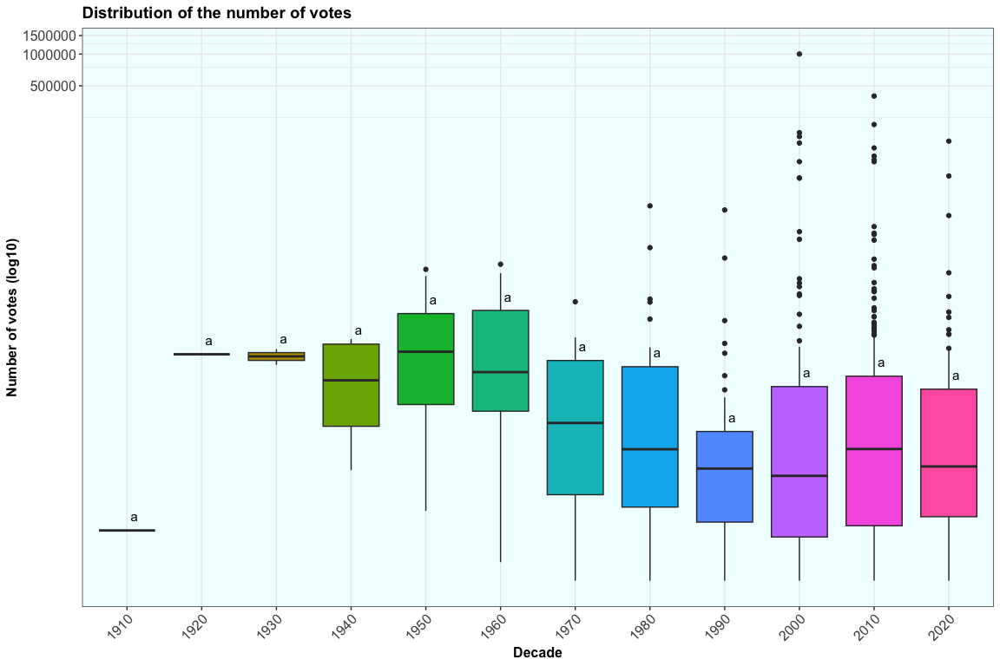
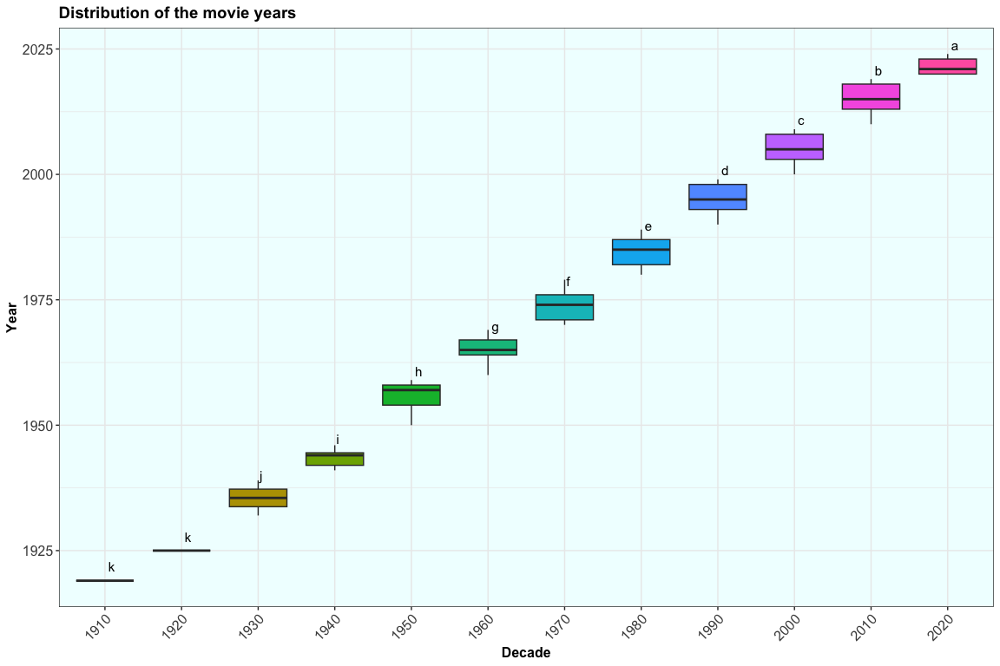

Week 10 - Tidy Tuesday 1
================
Keanu Rochette
2024-11-03

- [Load the libraries](#load-the-libraries)
- [Load the data](#load-the-data)
  - [Cleaning the Data](#cleaning-the-data)
- [Learning Something New: ANOVA & Tukey’s
  Test](#learning-something-new-anova--tukeys-test)
  - [Preparing the data](#preparing-the-data)
  - [Plotting](#plotting)
- [Creating a function to generate the ANOVA and Tukey’s
  test](#creating-a-function-to-generate-the-anova-and-tukeys-test)
  - [Testing the Function](#testing-the-function)
  - [Plotting](#plotting-1)
  - [More Examples](#more-examples)

# Load the libraries

``` r
library(tidyverse)
library(multcompView)
library(ghibli)
```

# Load the data

This week we have a data set about monster movies.

``` r
tuesdata <- tidytuesdayR::tt_load('2024-10-29')

monster_movie_genres <- tuesdata$monster_movie_genres
monster_movies <- tuesdata$monster_movies
```

## Cleaning the Data

I’m grouping the data by decade to create a new column variable.

``` r
monster_movies <- monster_movies %>% 
  mutate(decade = floor(year / 10) * 10) %>% 
  relocate(decade, .after = year)
```

# Learning Something New: ANOVA & Tukey’s Test

This week, I wanted to learn how to run an ANOVA and Tukey’s test.  
The code was adapted from:  
[Tutorial for ANOVA and Tukey’s
Test](https://statdoe.com/one-way-anova-and-box-plot-in-r/)

## Preparing the data

For this data set, we will compare the average ratings of monster movies
for the decades 1940, 1980, 1990, 2000, 2010 and 2020.

``` r
anova_monster <- monster_movies %>% 
  # selecting only the decades of interest
  filter(decade >= 1980 | decade ==1940) %>% 
  # changing the decades into ordered factors
  mutate(decade = factor(decade,
                         levels=c("1940", "1980", "1990",
                                "2000", "2010", "2020"))) %>% 
  # sub-setting the data to only keep the columns of interests
  select(decade, average_rating)

head(anova_monster, 7)
```

    ## # A tibble: 7 × 2
    ##   decade average_rating
    ##   <fct>           <dbl>
    ## 1 1940              6.1
    ## 2 1940              6  
    ## 3 1940              3.5
    ## 4 1940              6.1
    ## 5 1940              6.1
    ## 6 1940              5.7
    ## 7 1940              4.8

``` r
# running the anova test on the subset of data
anova <- aov(average_rating~decade, data = anova_monster)
summary.aov(anova)
```

    ##              Df Sum Sq Mean Sq F value  Pr(>F)   
    ## decade        5   47.5   9.510   3.858 0.00192 **
    ## Residuals   543 1338.6   2.465                   
    ## ---
    ## Signif. codes:  0 '***' 0.001 '**' 0.01 '*' 0.05 '.' 0.1 ' ' 1

``` r
# Running the Tukey's test to compare the difference between groups
tukey <- TukeyHSD(anova)
print(tukey)
```

    ##   Tukey multiple comparisons of means
    ##     95% family-wise confidence level
    ## 
    ## Fit: aov(formula = average_rating ~ decade, data = anova_monster)
    ## 
    ## $decade
    ##                 diff         lwr         upr     p adj
    ## 1980-1940  0.2300000 -1.35276407  1.81276407 0.9984124
    ## 1990-1940  1.1833333 -0.31769977  2.68436643 0.2148300
    ## 2000-1940  0.9398305 -0.47576356  2.35542457 0.4039829
    ## 2010-1940  0.6787879 -0.70696751  2.06454326 0.7265453
    ## 2020-1940  0.2954955 -1.12389963  1.71489062 0.9913305
    ## 1990-1980  0.9533333 -0.09174124  1.99840790 0.0968188
    ## 2000-1980  0.7098305 -0.20831275  1.62797377 0.2342632
    ## 2010-1980  0.4487879 -0.42264684  1.32022260 0.6818045
    ## 2020-1980  0.0654955 -0.85849747  0.98948846 0.9999528
    ## 2000-1990 -0.2435028 -1.01223250  0.52522685 0.9449577
    ## 2010-1990 -0.5045455 -1.21683524  0.20774433 0.3289539
    ## 2020-1990 -0.8878378 -1.66354478 -0.11213089 0.0143178
    ## 2010-2000 -0.2610426 -0.76914000  0.24705474 0.6840446
    ## 2020-2000 -0.6443350 -1.23807524 -0.05059479 0.0244961
    ## 2020-2010 -0.3832924 -0.90188556  0.13530079 0.2816243

``` r
# Compact Letter display: to show what groups are close to the other ones.
cld <- multcompLetters4(anova,tukey)
print(cld)
```

    ## $decade
    ## 1990 2000 2010 2020 1980 1940 
    ##  "a"  "a" "ab"  "b" "ab" "ab"

``` r
# calculating the average and the quantiles of the average ratings by decades 
# this allows to sort the data but decreasing order of the average. 
# Quantiles will be used later

Tk<- anova_monster %>% 
  group_by(decade) %>% 
  summarize(avg = mean(average_rating, na.rm = T),
            quant = quantile(average_rating, probs = 0.75, na.rm = T)) %>% 
  arrange(desc(avg))
```

``` r
# We pull the compact letter display from the cld data object and create a new column with the letters associated with the decades. 

# the quantiles will be used to plot the cld on the future box plots (y coordinates)

cld_df <- as.data.frame.list(cld[[1]])
Tk$cld <- cld_df$Letters
Tk
```

    ## # A tibble: 6 × 4
    ##   decade   avg quant cld  
    ##   <fct>  <dbl> <dbl> <chr>
    ## 1 1990    6.38  7.32 a    
    ## 2 2000    6.14  7.3  a    
    ## 3 2010    5.88  6.9  ab   
    ## 4 2020    5.50  6.8  b    
    ## 5 1980    5.43  6.3  ab   
    ## 6 1940    5.2   6.1  ab

## Plotting

``` r
anova_monster %>% # plotting our subset data
  # we are interested in the decade and the average ratings
  ggplot(aes(decade, average_rating))+
  geom_boxplot(aes(fill = decade))+
  #plot the letters using the quantile values (y coordinates) and offsetting their positions so they don't overlap with the box plots.
  geom_text(data =Tk, aes(x= decade, y = quant, label = cld),
            size = 4, vjust = -1, hjust =-1)+
  labs(title = "Distribution of the average movie ratings ",
       subtitle = "Comparison between selected decades",
       x = "Decade",
       y = "Average Rating",
       fill = "Decade") +
  theme_bw() + 
  theme(plot.title = element_text(size=14, face = "bold"), 
        plot.subtitle = element_text(size=12),
        axis.title = element_text(size = 12, face = "bold"),
        axis.text = element_text(size = 12),
        strip.text.x = element_text(size = 12, face = "bold"),
        legend.title=element_text(size=12, face = "bold"),
        legend.text=element_text(size=12),
        legend.position = "none",
        panel.background = element_rect(fill = "azure1"))+
  #custom the colors 
  scale_fill_ghibli_d("MarnieMedium1", direction =-1)
```

<!-- -->

# Creating a function to generate the ANOVA and Tukey’s test

Obtaining the final plot is slightly annoying because of all the things
that need to be calculated.

The goal to create a function that can generate the ANOVA, Tukey’s test
and Compact Letter Display in fewer lines of code.

``` r
# creating the function anova_nunu because it's mine. 
# the arguments of the fonction will be our data set, the independant variable and the dependant variable of interest. 

anova_nunu <- function(data, indep_var, dep_var ) {

  # we want to make sure that the independent variable is a categorical variable. I set it up such that if the independent variable is not a factor, an error appears and stops the computation. 
  if (is.factor(data %>%  pull({{indep_var}})) ) {
    print("indep var is a factor")
  } else {
    stop("indep var is not a factor")
  }
  
  # same idea here for the dependent varible which has to be a numeric. Otherwise, an error shows. 
  if (is.numeric(data %>% pull({{dep_var}}))) {
    print("dep var is numeric")
  } else {
    stop("dep var is not numeric")
  }

  #Ok... So I couldn't figure out how to feed the data to aov() without having an error. I did resort to used chat GPT for that bit of code. 
  
  # I am not exactly sure what all the functions do, but the idea is the following. We take the column names from the data set, paste it so that it looks like "dep_var ~ indep var" (required input to the aov() function) and tell R to process that as a formula. 
  formula <- as.formula(paste(deparse(substitute(dep_var)), "~", deparse(substitute(indep_var))))
  
  # calculating the anova based on the formula above and with our data set.
  anova <- aov(formula, data = data)
  anova <<- anova # saves anova in the RStudio  environment
  
  # applying the Tukey's test
  tukey <- TukeyHSD(anova) 
  tukey <<- tukey # saves tukey in the RStudio  environment
  
  #generating the compact letter display (cld).
  cld <- multcompLetters4(anova,tukey)
  
  #generating a data set with the cld that can be plotted with the quantiles
  Tk<- data %>% 
    group_by({{indep_var}}) %>% 
    summarize(avg = mean({{dep_var}}, na.rm = T),
            quant = quantile({{dep_var}}, probs = 0.75, na.rm = T)) %>% 
    arrange(desc(avg))
  
  # pull the cld and adding them to the data set with the quantiles.
  cld_df <- as.data.frame.list(cld[[1]])
  Tk$cld <- cld_df$Letters
  
  # saves Tk in the RStudio  environment
  Tk <<- Tk  
  
  # tell the user that Tk has been saved and can be used for plotting
  print("Tk saved in environment" )
  return(Tk)

}
```

## Testing the Function

First, we will recreate the example plot from earlier with all the
decades.

    # This chunk shows an error because decade has not been converted to factor yet.  
    This awesome because my function works ! 

    anova_nunu(data = monster_movies, indep_var = decade, dep_var = average_rating)

    Error in anova_nunu(data = monster_movies, indep_var = decade, dep_var = average_rating) : 
      indep var is not a factor

``` r
# first we convert the decades to factors
monster_movies<- monster_movies %>% 
  mutate(decade = factor(decade)) %>% 
  drop_na()

# Apply the Nunu function
anova_nunu(data = monster_movies, indep_var = decade, dep_var = average_rating)
```

    ## [1] "indep var is a factor"
    ## [1] "dep var is numeric"
    ## [1] "Tk saved in environment"

    ## # A tibble: 12 × 4
    ##    decade   avg quant cld  
    ##    <fct>  <dbl> <dbl> <chr>
    ##  1 1990    6.35  7.3  a    
    ##  2 1920    6.2   6.2  ab   
    ##  3 2000    6.08  7.2  a    
    ##  4 1970    5.87  6.92 ab   
    ##  5 2010    5.78  6.7  ab   
    ##  6 1980    5.5   6.3  ab   
    ##  7 2020    5.46  6.78 ab   
    ##  8 1940    5.2   6.1  ab   
    ##  9 1930    4.9   5.3  ab   
    ## 10 1960    4.88  6.22 b    
    ## 11 1950    4.87  5.82 b    
    ## 12 1910    2.7   2.7  ab

## Plotting

As we can see, the function works and I was able to generate the cld
from the ANOVA and Tukey’s test for all the decades now.

``` r
monster_movies %>% 
  ggplot(aes(decade, average_rating))+
  geom_boxplot(aes(fill = decade))+
  geom_text(data =Tk, aes(x= decade, y = quant, label = cld),
            size = 4, vjust = -1, hjust =-0.5)+
   labs(title = "Distribution of the average movie ratings ",
       subtitle = "Comparison between all decades",
       x = "Decade",
       y = "Average Rating",
       fill = "Decade") +
  theme_bw() + 
  theme(plot.title = element_text(size=14, face = "bold"), 
        plot.subtitle = element_text(size=12),
        axis.title = element_text(size = 12, face = "bold"),
        axis.text = element_text(size = 12),
        strip.text.x = element_text(size = 12, face = "bold"),
        legend.title=element_text(size=12, face = "bold"),
        legend.text=element_text(size=12),
        axis.text.x = element_text(angle= 45, hjust= 1),
        legend.position = "none",
        panel.background = element_rect(fill = "azure1")) 
```

<!-- -->

``` r
# I couldn't add custom colors though, because the Ghibli palettes do not have enough colors to cover all the decades.
```

## More Examples

``` r
# Apply the Nunu function : Movie Run Time
anova_nunu(data = monster_movies, indep_var = decade, dep_var = runtime_minutes)
```

    ## [1] "indep var is a factor"
    ## [1] "dep var is numeric"
    ## [1] "Tk saved in environment"

    ## # A tibble: 12 × 4
    ##    decade   avg quant cld  
    ##    <fct>  <dbl> <dbl> <chr>
    ##  1 1940   100.   81.5 ab   
    ##  2 2020    89.4  98   a    
    ##  3 1920    86    86   abc  
    ##  4 1970    85.0  92.2 abc  
    ##  5 1980    84.6 100   abc  
    ##  6 1960    81.9  88   abc  
    ##  7 2010    81.2  94.8 ab   
    ##  8 1950    78.8  78   abc  
    ##  9 1990    72.6  89   bc   
    ## 10 2000    68.6  91   c    
    ## 11 1930    65    69   abc  
    ## 12 1910    50    50   abc

``` r
monster_movies %>% 
  ggplot(aes(decade, runtime_minutes))+
  geom_boxplot(aes(fill = decade))+
  geom_text(data =Tk, aes(x= decade, y = quant, label = cld),
            size = 4, vjust = -1, hjust =-0.5)+
   labs(title = "Distribution of the movie run times",
       x = "Decade",
       y = "Run Time (min) [sqrt-transformed]",
       fill = "Decade") +
  coord_trans(y = "sqrt")+
  theme_bw() + 
  theme(plot.title = element_text(size=14, face = "bold"), 
        plot.subtitle = element_text(size=12),
        axis.title = element_text(size = 12, face = "bold"),
        axis.text = element_text(size = 12),
        strip.text.x = element_text(size = 12, face = "bold"),
        legend.title=element_text(size=12, face = "bold"),
        legend.text=element_text(size=12),
        axis.text.x = element_text(angle= 45, hjust= 1),
        legend.position = "none",
        panel.background = element_rect(fill = "azure1")) 
```

<!-- -->

``` r
# Apply the Nunu function: Number of votes 
anova_nunu(data = monster_movies, indep_var = decade, dep_var = num_votes)
```

    ## [1] "indep var is a factor"
    ## [1] "dep var is numeric"
    ## [1] "Tk saved in environment"

    ## # A tibble: 12 × 4
    ##    decade    avg quant cld  
    ##    <fct>   <dbl> <dbl> <chr>
    ##  1 2000   17599.  697  a    
    ##  2 2010    6202.  874  a    
    ##  3 2020    3070.  658. a    
    ##  4 1980    2416. 1076  a    
    ##  5 1960    2392. 3684  a    
    ##  6 1950    2339. 3437  a    
    ##  7 1920    1412  1412  a    
    ##  8 1990    1383.  261  a    
    ##  9 1930    1350. 1464. a    
    ## 10 1940     995. 1763  a    
    ## 11 1970     763. 1232. a    
    ## 12 1910      30    30  a

``` r
monster_movies %>% 
  ggplot(aes(decade, num_votes))+
  geom_boxplot(aes(fill = decade))+
  geom_text(data =Tk, aes(x= decade, y = quant, label = cld),
            size = 4, vjust = -1, hjust =-0.5)+
   labs(title = "Distribution of the number of votes",
       x = "Decade",
       y = "Number of votes (log10)",
       fill = "Decade") +
  coord_trans(y = "log10")+
  theme_bw() + 
  theme(plot.title = element_text(size=14, face = "bold"), 
        plot.subtitle = element_text(size=12),
        axis.title = element_text(size = 12, face = "bold"),
        axis.text = element_text(size = 12),
        strip.text.x = element_text(size = 12, face = "bold"),
        legend.title=element_text(size=12, face = "bold"),
        legend.text=element_text(size=12),
        axis.text.x = element_text(angle= 45, hjust= 1),
        legend.position = "none",
        panel.background = element_rect(fill = "azure1")) 
```

<!-- -->

``` r
# Apply the Nunu function: Years 
#This plot is mostly for fun as it has no statistical meaning/relevance
anova_nunu(data = monster_movies, indep_var = decade, dep_var = year)
```

    ## [1] "indep var is a factor"
    ## [1] "dep var is numeric"
    ## [1] "Tk saved in environment"

    ## # A tibble: 12 × 4
    ##    decade   avg quant cld  
    ##    <fct>  <dbl> <dbl> <chr>
    ##  1 2020   2022. 2023  a    
    ##  2 2010   2015. 2018  b    
    ##  3 2000   2005. 2008  c    
    ##  4 1990   1996. 1998  d    
    ##  5 1980   1985. 1987  e    
    ##  6 1970   1974. 1976  f    
    ##  7 1960   1965. 1967  g    
    ##  8 1950   1956. 1958  h    
    ##  9 1940   1943. 1944. i    
    ## 10 1930   1936. 1937. j    
    ## 11 1920   1925  1925  k    
    ## 12 1910   1919  1919  k

``` r
monster_movies %>% 
  ggplot(aes(decade, year))+
  geom_boxplot(aes(fill = decade))+
  geom_text(data =Tk, aes(x= decade, y = quant, label = cld),
            size = 4, vjust = -1, hjust =-0.5)+
   labs(title = "Distribution of the movie years",
       x = "Decade",
       y = "Year",
       fill = "Decade") +
  theme_bw() + 
  theme(plot.title = element_text(size=14, face = "bold"), 
        plot.subtitle = element_text(size=12),
        axis.title = element_text(size = 12, face = "bold"),
        axis.text = element_text(size = 12),
        strip.text.x = element_text(size = 12, face = "bold"),
        legend.title=element_text(size=12, face = "bold"),
        legend.text=element_text(size=12),
        axis.text.x = element_text(angle= 45, hjust= 1),
        legend.position = "none",
        panel.background = element_rect(fill = "azure1")) 
```

<!-- -->
