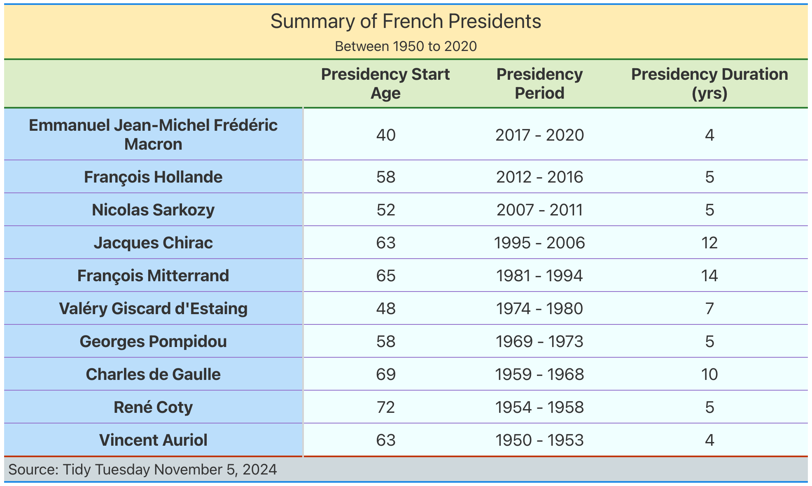

```{r setup, include = FALSE}
knitr::opts_chunk$set(echo = TRUE,
                      message = FALSE,
                      warning = FALSE,
                      fig.width = 12,
                      fig.height = 8,
                      fig.path = "../outputs/")
```

# Load the libraries
```{r}
library(tidyverse)
library(maps)
library(gt)
library(here)
```

# Load the data
This week we have a data set about monster movies. 
```{r}
tuesdata <- tidytuesdayR::tt_load('2024-11-05')

democracy <- tuesdata$democracy_data

world <- map_data("world")
```


# This week's practice: Tables

Though we had a lecture on tables before, I wanted to practice making custom summary tables using {gt} tables.  

For this table, we'll focus on data related to French Presidents and make a table summary of it.
```{r}
pres_table <- democracy %>% 
  filter(country_name == "France") %>%  
  arrange(desc(year)) %>% # we want an ordered table by year
  group_by(president_name) %>% 
  summarize(
    # calculate the age at which the president stepped into office
    age_leader = president_accesion_year - president_birthyear,
   # subtracking the presidency year doesn't account for the 1st year, hence the +1
     presidency_duration = max(year, na.rm = T) - min(year, na.rm = T) + 1,
   # we pull out the start and ending year of each president's presidency
            presidency_start= min(year, na.rm = T),
            presidency_stop= max(year, na.rm = T)) %>% 
  distinct() %>% ungroup() %>% 
  # we want to order the presidents in decreasing chronological order
  arrange(desc(presidency_start)) %>%
  # we'll make a column display the presidency period
  mutate(presidency_period = paste(presidency_start, "-",presidency_stop)) %>% 
  # only select the columns of interest
  select(president_name, age_leader, presidency_period, presidency_duration) %>% 
  # create the gt table with a title and subtitle
  gt(rowname_col = "president_name") %>% 
    tab_header(title = "Summary of French Presidents", 
             subtitle= "Between 1950 to 2020 ")  %>%
  
  # change the column names into prettier names
  cols_label(
    president_name = "President",
    age_leader = "Presidency Start Age",
    presidency_period = "Presidency Period",
    presidency_duration = "Presidency Duration (yrs)"
  ) %>% 
  tab_source_note("Source: Tidy Tuesday November 5, 2024") %>%
  
  # center text within the columns 
  cols_align(
    align = "center",
    columns = everything()) %>% 

  # adding more custom elements on the table
  tab_options(
    table.width = "100%", #table width
    table.font.size = 20, #text font
    
    # somehow, the title and subtitle are not getting bolded
    heading.title.font.weight = "bolder",      
    heading.subtitle.font.weight = "bolder", 
    column_labels.font.weight = "bolder",
    stub.font.weight = "bold",
    
    # Table borders custom colors
    table.border.top.color = "#1E88E5",
    table.border.bottom.color = "#1E88E5",
    heading.border.bottom.color = "#2E7D32", 
    column_labels.border.bottom.color = "#2E7D32",  
    table_body.border.bottom.color = "#BF360C", 
    table_body.hlines.color = "#9575CD", 
    table_body.vlines.color = "#9575CD", 
    
    # Customs background color
    heading.background.color = "#FFECB3",
    column_labels.background.color = "#DCEDC8",
    stub.background.color = "#BBDEFB",
    table.background.color = "azure",
    source_notes.background.color = "#CFD8DC")
```

## Saving the output table as an image 
When I upload the file to github, the table does not render and only the metadata text is printed. 

```{}
gtsave(pres_table, "pres_summary_table.png", path = here("Tidy_Tuesday", "tidy_tuesday_2", "outputs"))
```



# Playing with maps
I also wanted to play with making maps

## Data organization and clean up
```{r}
#loading the world data and renaming the regions to match the democracy data
world <- world %>% 
  rename(country_name = region)

world<-world %>% 
  mutate(country_name = ifelse(country_name == "USA", "United States", country_name))
```

```{r}
#joining the dataset into one
democracy_join <- left_join(democracy, world, by = "country_name")
```


## Plotting the map 
```{r map_electoral_categories}
democracy_join %>% select(country_name, year,
                          lat, long, group, electoral_category) %>% 
  distinct() %>% 
  mutate(year = as.factor(year),
         electoral_category = str_to_title(electoral_category)) %>% 
  ggplot() +
  geom_polygon(aes(x=long, y=lat, group = group,
                                 fill = electoral_category), # color by regions
                                 color = "black") + #black outlines on the map
  #guides(fill = FALSE) + # remove the legend because too many
  theme_minimal()+
  theme(panel.background = element_rect(fill = "lightblue"))+
  coord_map(projection = "mercator",
            xlim = (c(-180,180))) +
  labs(title = "Electoral Categories in the World",
       subtitle = "Coarse mapping",
       x = "Longitude",
       y = "latitude",
       fill = "Electoral Categories") +
  theme_bw() + 
  theme(plot.title = element_text(size=14, face = "bold"), 
        plot.subtitle = element_text(size=12),
        axis.title = element_text(size = 12, face = "bold"),
        axis.text = element_text(size = 12),
        strip.text.x = element_text(size = 12, face = "bold"),
        legend.title=element_text(size=12, face = "bold"),
        legend.text=element_text(size=12),
        panel.background = element_rect(fill = "azure1"))
  
```

## Addressing anomalies in the map
Some of the countries on not being mapped, their must be an issue when datasets get merged. 
```{r}
mismatch <- anti_join(democracy, world, by= "country_name")

mismatch %>% select(country_name) %>% distinct() %>% 
  gt() %>% cols_label(country_name = "Missing countries") %>% 
  tab_options(column_labels.font.weight = "bolder")
```

# Learning outcomes of the week

- Practicing generating tables with gt tables
- Making simple maps
- Caveats of the join functions when data don't match in the datasets that we want to join


