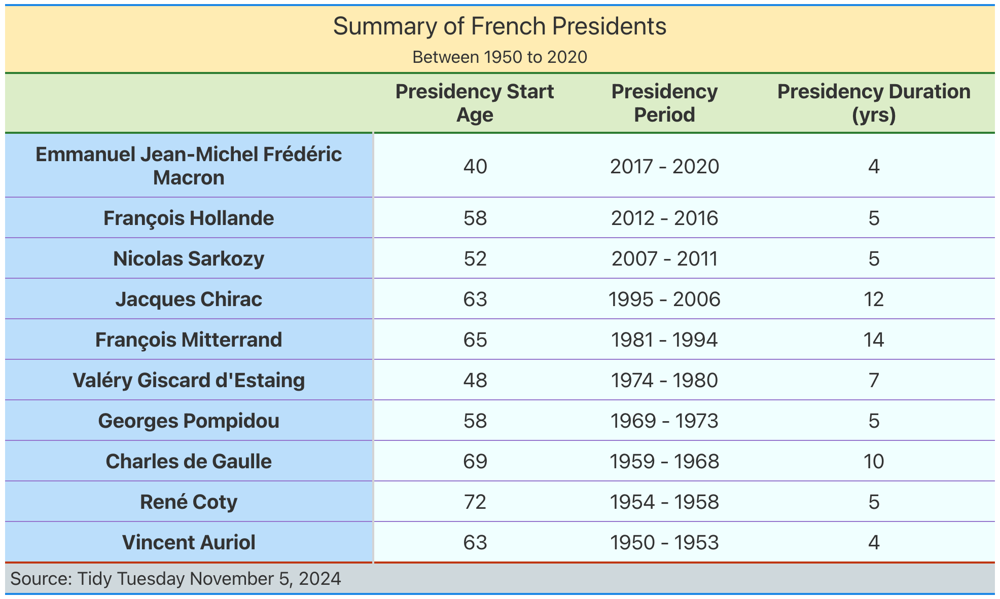

Week 11 - Tidy Tuesday 2
================
Keanu Rochette
2024-11-08

- [Load the libraries](#load-the-libraries)
- [Load the data](#load-the-data)
- [This week’s practice: Tables](#this-weeks-practice-tables)
  - [Saving the output table as an
    image](#saving-the-output-table-as-an-image)
- [Playing with maps](#playing-with-maps)
  - [Data organization and clean up](#data-organization-and-clean-up)
  - [Plotting the map](#plotting-the-map)
  - [Addressing anomalies in the map](#addressing-anomalies-in-the-map)
- [Learning outcomes of the week](#learning-outcomes-of-the-week)

# Load the libraries

``` r
library(tidyverse)
library(maps)
library(gt)
library(here)
```

# Load the data

This week we have a data set about monster movies.

``` r
tuesdata <- tidytuesdayR::tt_load('2024-11-05')

democracy <- tuesdata$democracy_data

world <- map_data("world")
```

# This week’s practice: Tables

Though we had a lecture on tables before, I wanted to practice making
custom summary tables using {gt} tables.

For this table, we’ll focus on data related to French Presidents and
make a table summary of it.

``` r
pres_table <- democracy %>% 
  filter(country_name == "France") %>%  
  arrange(desc(year)) %>% # we want an ordered table by year
  group_by(president_name) %>% 
  summarize(
    # calculate the age at which the president stepped into office
    age_leader = president_accesion_year - president_birthyear,
   # subtracking the presidency year doesn't account for the 1st year, hence the +1
     presidency_duration = max(year, na.rm = T) - min(year, na.rm = T) + 1,
   # we pull out the start and ending year of each president's presidency
            presidency_start= min(year, na.rm = T),
            presidency_stop= max(year, na.rm = T)) %>% 
  distinct() %>% ungroup() %>% 
  # we want to order the presidents in decreasing chronological order
  arrange(desc(presidency_start)) %>%
  # we'll make a column display the presidency period
  mutate(presidency_period = paste(presidency_start, "-",presidency_stop)) %>% 
  # only select the columns of interest
  select(president_name, age_leader, presidency_period, presidency_duration) %>% 
  # create the gt table with a title and subtitle
  gt(rowname_col = "president_name") %>% 
    tab_header(title = "Summary of French Presidents", 
             subtitle= "Between 1950 to 2020 ")  %>%
  
  # change the column names into prettier names
  cols_label(
    president_name = "President",
    age_leader = "Presidency Start Age",
    presidency_period = "Presidency Period",
    presidency_duration = "Presidency Duration (yrs)"
  ) %>% 
  tab_source_note("Source: Tidy Tuesday November 5, 2024") %>%
  
  # center text within the columns 
  cols_align(
    align = "center",
    columns = everything()) %>% 

  # adding more custom elements on the table
  tab_options(
    table.width = "100%", #table width
    table.font.size = 20, #text font
    
    # somehow, the title and subtitle are not getting bolded
    heading.title.font.weight = "bolder",      
    heading.subtitle.font.weight = "bolder", 
    column_labels.font.weight = "bolder",
    stub.font.weight = "bold",
    
    # Table borders custom colors
    table.border.top.color = "#1E88E5",
    table.border.bottom.color = "#1E88E5",
    heading.border.bottom.color = "#2E7D32", 
    column_labels.border.bottom.color = "#2E7D32",  
    table_body.border.bottom.color = "#BF360C", 
    table_body.hlines.color = "#9575CD", 
    table_body.vlines.color = "#9575CD", 
    
    # Customs background color
    heading.background.color = "#FFECB3",
    column_labels.background.color = "#DCEDC8",
    stub.background.color = "#BBDEFB",
    table.background.color = "azure",
    source_notes.background.color = "#CFD8DC")
```

## Saving the output table as an image

When I upload the file to github, the table does not render and only the
metadata text is printed.

``` r
gtsave(pres_table, "pres_summary_table.png", path = here("Tidy_Tuesday", "tidy_tuesday_2", "outputs"))
```

<figure>

<figcaption aria-hidden="true">French President Table
Summary</figcaption>
</figure>

# Playing with maps

I also wanted to play with making maps

## Data organization and clean up

``` r
#loading the world data and renaming the regions to match the democracy data
world <- world %>% 
  rename(country_name = region)

world<-world %>% 
  mutate(country_name = ifelse(country_name == "USA", "United States", country_name))
```

``` r
#joining the dataset into one
democracy_join <- left_join(democracy, world, by = "country_name")
```

## Plotting the map

``` r
democracy_join %>% select(country_name, year,
                          lat, long, group, electoral_category) %>% 
  distinct() %>% 
  mutate(year = as.factor(year),
         electoral_category = str_to_title(electoral_category)) %>% 
  ggplot() +
  geom_polygon(aes(x=long, y=lat, group = group,
                                 fill = electoral_category), # color by regions
                                 color = "black") + #black outlines on the map
  #guides(fill = FALSE) + # remove the legend because too many
  theme_minimal()+
  theme(panel.background = element_rect(fill = "lightblue"))+
  coord_map(projection = "mercator",
            xlim = (c(-180,180))) +
  labs(title = "Electoral Categories in the World",
       subtitle = "Coarse mapping",
       x = "Longitude",
       y = "latitude",
       fill = "Electoral Categories") +
  theme_bw() + 
  theme(plot.title = element_text(size=14, face = "bold"), 
        plot.subtitle = element_text(size=12),
        axis.title = element_text(size = 12, face = "bold"),
        axis.text = element_text(size = 12),
        strip.text.x = element_text(size = 12, face = "bold"),
        legend.title=element_text(size=12, face = "bold"),
        legend.text=element_text(size=12),
        panel.background = element_rect(fill = "azure1"))
```

<!-- -->

## Addressing anomalies in the map

Some of the countries on not being mapped, their must be an issue when
datasets get merged.

``` r
mismatch <- anti_join(democracy, world, by= "country_name")

mismatch %>% select(country_name) %>% distinct() %>% 
  gt() %>% cols_label(country_name = "Missing countries") %>% 
  tab_options(column_labels.font.weight = "bolder")
```

<div id="mffwfieooz" style="padding-left:0px;padding-right:0px;padding-top:10px;padding-bottom:10px;overflow-x:auto;overflow-y:auto;width:auto;height:auto;">
<style>#mffwfieooz table {
  font-family: system-ui, 'Segoe UI', Roboto, Helvetica, Arial, sans-serif, 'Apple Color Emoji', 'Segoe UI Emoji', 'Segoe UI Symbol', 'Noto Color Emoji';
  -webkit-font-smoothing: antialiased;
  -moz-osx-font-smoothing: grayscale;
}
&#10;#mffwfieooz thead, #mffwfieooz tbody, #mffwfieooz tfoot, #mffwfieooz tr, #mffwfieooz td, #mffwfieooz th {
  border-style: none;
}
&#10;#mffwfieooz p {
  margin: 0;
  padding: 0;
}
&#10;#mffwfieooz .gt_table {
  display: table;
  border-collapse: collapse;
  line-height: normal;
  margin-left: auto;
  margin-right: auto;
  color: #333333;
  font-size: 16px;
  font-weight: normal;
  font-style: normal;
  background-color: #FFFFFF;
  width: auto;
  border-top-style: solid;
  border-top-width: 2px;
  border-top-color: #A8A8A8;
  border-right-style: none;
  border-right-width: 2px;
  border-right-color: #D3D3D3;
  border-bottom-style: solid;
  border-bottom-width: 2px;
  border-bottom-color: #A8A8A8;
  border-left-style: none;
  border-left-width: 2px;
  border-left-color: #D3D3D3;
}
&#10;#mffwfieooz .gt_caption {
  padding-top: 4px;
  padding-bottom: 4px;
}
&#10;#mffwfieooz .gt_title {
  color: #333333;
  font-size: 125%;
  font-weight: initial;
  padding-top: 4px;
  padding-bottom: 4px;
  padding-left: 5px;
  padding-right: 5px;
  border-bottom-color: #FFFFFF;
  border-bottom-width: 0;
}
&#10;#mffwfieooz .gt_subtitle {
  color: #333333;
  font-size: 85%;
  font-weight: initial;
  padding-top: 3px;
  padding-bottom: 5px;
  padding-left: 5px;
  padding-right: 5px;
  border-top-color: #FFFFFF;
  border-top-width: 0;
}
&#10;#mffwfieooz .gt_heading {
  background-color: #FFFFFF;
  text-align: center;
  border-bottom-color: #FFFFFF;
  border-left-style: none;
  border-left-width: 1px;
  border-left-color: #D3D3D3;
  border-right-style: none;
  border-right-width: 1px;
  border-right-color: #D3D3D3;
}
&#10;#mffwfieooz .gt_bottom_border {
  border-bottom-style: solid;
  border-bottom-width: 2px;
  border-bottom-color: #D3D3D3;
}
&#10;#mffwfieooz .gt_col_headings {
  border-top-style: solid;
  border-top-width: 2px;
  border-top-color: #D3D3D3;
  border-bottom-style: solid;
  border-bottom-width: 2px;
  border-bottom-color: #D3D3D3;
  border-left-style: none;
  border-left-width: 1px;
  border-left-color: #D3D3D3;
  border-right-style: none;
  border-right-width: 1px;
  border-right-color: #D3D3D3;
}
&#10;#mffwfieooz .gt_col_heading {
  color: #333333;
  background-color: #FFFFFF;
  font-size: 100%;
  font-weight: bolder;
  text-transform: inherit;
  border-left-style: none;
  border-left-width: 1px;
  border-left-color: #D3D3D3;
  border-right-style: none;
  border-right-width: 1px;
  border-right-color: #D3D3D3;
  vertical-align: bottom;
  padding-top: 5px;
  padding-bottom: 6px;
  padding-left: 5px;
  padding-right: 5px;
  overflow-x: hidden;
}
&#10;#mffwfieooz .gt_column_spanner_outer {
  color: #333333;
  background-color: #FFFFFF;
  font-size: 100%;
  font-weight: bolder;
  text-transform: inherit;
  padding-top: 0;
  padding-bottom: 0;
  padding-left: 4px;
  padding-right: 4px;
}
&#10;#mffwfieooz .gt_column_spanner_outer:first-child {
  padding-left: 0;
}
&#10;#mffwfieooz .gt_column_spanner_outer:last-child {
  padding-right: 0;
}
&#10;#mffwfieooz .gt_column_spanner {
  border-bottom-style: solid;
  border-bottom-width: 2px;
  border-bottom-color: #D3D3D3;
  vertical-align: bottom;
  padding-top: 5px;
  padding-bottom: 5px;
  overflow-x: hidden;
  display: inline-block;
  width: 100%;
}
&#10;#mffwfieooz .gt_spanner_row {
  border-bottom-style: hidden;
}
&#10;#mffwfieooz .gt_group_heading {
  padding-top: 8px;
  padding-bottom: 8px;
  padding-left: 5px;
  padding-right: 5px;
  color: #333333;
  background-color: #FFFFFF;
  font-size: 100%;
  font-weight: initial;
  text-transform: inherit;
  border-top-style: solid;
  border-top-width: 2px;
  border-top-color: #D3D3D3;
  border-bottom-style: solid;
  border-bottom-width: 2px;
  border-bottom-color: #D3D3D3;
  border-left-style: none;
  border-left-width: 1px;
  border-left-color: #D3D3D3;
  border-right-style: none;
  border-right-width: 1px;
  border-right-color: #D3D3D3;
  vertical-align: middle;
  text-align: left;
}
&#10;#mffwfieooz .gt_empty_group_heading {
  padding: 0.5px;
  color: #333333;
  background-color: #FFFFFF;
  font-size: 100%;
  font-weight: initial;
  border-top-style: solid;
  border-top-width: 2px;
  border-top-color: #D3D3D3;
  border-bottom-style: solid;
  border-bottom-width: 2px;
  border-bottom-color: #D3D3D3;
  vertical-align: middle;
}
&#10;#mffwfieooz .gt_from_md > :first-child {
  margin-top: 0;
}
&#10;#mffwfieooz .gt_from_md > :last-child {
  margin-bottom: 0;
}
&#10;#mffwfieooz .gt_row {
  padding-top: 8px;
  padding-bottom: 8px;
  padding-left: 5px;
  padding-right: 5px;
  margin: 10px;
  border-top-style: solid;
  border-top-width: 1px;
  border-top-color: #D3D3D3;
  border-left-style: none;
  border-left-width: 1px;
  border-left-color: #D3D3D3;
  border-right-style: none;
  border-right-width: 1px;
  border-right-color: #D3D3D3;
  vertical-align: middle;
  overflow-x: hidden;
}
&#10;#mffwfieooz .gt_stub {
  color: #333333;
  background-color: #FFFFFF;
  font-size: 100%;
  font-weight: initial;
  text-transform: inherit;
  border-right-style: solid;
  border-right-width: 2px;
  border-right-color: #D3D3D3;
  padding-left: 5px;
  padding-right: 5px;
}
&#10;#mffwfieooz .gt_stub_row_group {
  color: #333333;
  background-color: #FFFFFF;
  font-size: 100%;
  font-weight: initial;
  text-transform: inherit;
  border-right-style: solid;
  border-right-width: 2px;
  border-right-color: #D3D3D3;
  padding-left: 5px;
  padding-right: 5px;
  vertical-align: top;
}
&#10;#mffwfieooz .gt_row_group_first td {
  border-top-width: 2px;
}
&#10;#mffwfieooz .gt_row_group_first th {
  border-top-width: 2px;
}
&#10;#mffwfieooz .gt_summary_row {
  color: #333333;
  background-color: #FFFFFF;
  text-transform: inherit;
  padding-top: 8px;
  padding-bottom: 8px;
  padding-left: 5px;
  padding-right: 5px;
}
&#10;#mffwfieooz .gt_first_summary_row {
  border-top-style: solid;
  border-top-color: #D3D3D3;
}
&#10;#mffwfieooz .gt_first_summary_row.thick {
  border-top-width: 2px;
}
&#10;#mffwfieooz .gt_last_summary_row {
  padding-top: 8px;
  padding-bottom: 8px;
  padding-left: 5px;
  padding-right: 5px;
  border-bottom-style: solid;
  border-bottom-width: 2px;
  border-bottom-color: #D3D3D3;
}
&#10;#mffwfieooz .gt_grand_summary_row {
  color: #333333;
  background-color: #FFFFFF;
  text-transform: inherit;
  padding-top: 8px;
  padding-bottom: 8px;
  padding-left: 5px;
  padding-right: 5px;
}
&#10;#mffwfieooz .gt_first_grand_summary_row {
  padding-top: 8px;
  padding-bottom: 8px;
  padding-left: 5px;
  padding-right: 5px;
  border-top-style: double;
  border-top-width: 6px;
  border-top-color: #D3D3D3;
}
&#10;#mffwfieooz .gt_last_grand_summary_row_top {
  padding-top: 8px;
  padding-bottom: 8px;
  padding-left: 5px;
  padding-right: 5px;
  border-bottom-style: double;
  border-bottom-width: 6px;
  border-bottom-color: #D3D3D3;
}
&#10;#mffwfieooz .gt_striped {
  background-color: rgba(128, 128, 128, 0.05);
}
&#10;#mffwfieooz .gt_table_body {
  border-top-style: solid;
  border-top-width: 2px;
  border-top-color: #D3D3D3;
  border-bottom-style: solid;
  border-bottom-width: 2px;
  border-bottom-color: #D3D3D3;
}
&#10;#mffwfieooz .gt_footnotes {
  color: #333333;
  background-color: #FFFFFF;
  border-bottom-style: none;
  border-bottom-width: 2px;
  border-bottom-color: #D3D3D3;
  border-left-style: none;
  border-left-width: 2px;
  border-left-color: #D3D3D3;
  border-right-style: none;
  border-right-width: 2px;
  border-right-color: #D3D3D3;
}
&#10;#mffwfieooz .gt_footnote {
  margin: 0px;
  font-size: 90%;
  padding-top: 4px;
  padding-bottom: 4px;
  padding-left: 5px;
  padding-right: 5px;
}
&#10;#mffwfieooz .gt_sourcenotes {
  color: #333333;
  background-color: #FFFFFF;
  border-bottom-style: none;
  border-bottom-width: 2px;
  border-bottom-color: #D3D3D3;
  border-left-style: none;
  border-left-width: 2px;
  border-left-color: #D3D3D3;
  border-right-style: none;
  border-right-width: 2px;
  border-right-color: #D3D3D3;
}
&#10;#mffwfieooz .gt_sourcenote {
  font-size: 90%;
  padding-top: 4px;
  padding-bottom: 4px;
  padding-left: 5px;
  padding-right: 5px;
}
&#10;#mffwfieooz .gt_left {
  text-align: left;
}
&#10;#mffwfieooz .gt_center {
  text-align: center;
}
&#10;#mffwfieooz .gt_right {
  text-align: right;
  font-variant-numeric: tabular-nums;
}
&#10;#mffwfieooz .gt_font_normal {
  font-weight: normal;
}
&#10;#mffwfieooz .gt_font_bold {
  font-weight: bold;
}
&#10;#mffwfieooz .gt_font_italic {
  font-style: italic;
}
&#10;#mffwfieooz .gt_super {
  font-size: 65%;
}
&#10;#mffwfieooz .gt_footnote_marks {
  font-size: 75%;
  vertical-align: 0.4em;
  position: initial;
}
&#10;#mffwfieooz .gt_asterisk {
  font-size: 100%;
  vertical-align: 0;
}
&#10;#mffwfieooz .gt_indent_1 {
  text-indent: 5px;
}
&#10;#mffwfieooz .gt_indent_2 {
  text-indent: 10px;
}
&#10;#mffwfieooz .gt_indent_3 {
  text-indent: 15px;
}
&#10;#mffwfieooz .gt_indent_4 {
  text-indent: 20px;
}
&#10;#mffwfieooz .gt_indent_5 {
  text-indent: 25px;
}
&#10;#mffwfieooz .katex-display {
  display: inline-flex !important;
  margin-bottom: 0.75em !important;
}
&#10;#mffwfieooz div.Reactable > div.rt-table > div.rt-thead > div.rt-tr.rt-tr-group-header > div.rt-th-group:after {
  height: 0px !important;
}
</style>
<table class="gt_table" data-quarto-disable-processing="false" data-quarto-bootstrap="false">
  <thead>
    <tr class="gt_col_headings">
      <th class="gt_col_heading gt_columns_bottom_border gt_left" rowspan="1" colspan="1" scope="col" id="Missing countries">Missing countries</th>
    </tr>
  </thead>
  <tbody class="gt_table_body">
    <tr><td headers="country_name" class="gt_row gt_left">Antigua and Barbuda</td></tr>
    <tr><td headers="country_name" class="gt_row gt_left">British Virgin Islands</td></tr>
    <tr><td headers="country_name" class="gt_row gt_left">Congo, Dem. Rep.</td></tr>
    <tr><td headers="country_name" class="gt_row gt_left">Congo, Republic of</td></tr>
    <tr><td headers="country_name" class="gt_row gt_left">Côte d`Ivoire</td></tr>
    <tr><td headers="country_name" class="gt_row gt_left">Gambia, The</td></tr>
    <tr><td headers="country_name" class="gt_row gt_left">Gibraltar</td></tr>
    <tr><td headers="country_name" class="gt_row gt_left">Hong Kong</td></tr>
    <tr><td headers="country_name" class="gt_row gt_left">Korea, People's Republic</td></tr>
    <tr><td headers="country_name" class="gt_row gt_left">Korea, Republic of</td></tr>
    <tr><td headers="country_name" class="gt_row gt_left">Macao</td></tr>
    <tr><td headers="country_name" class="gt_row gt_left">Micronesia, Fed. Sts.</td></tr>
    <tr><td headers="country_name" class="gt_row gt_left">Slovak Republic</td></tr>
    <tr><td headers="country_name" class="gt_row gt_left">St. Kitts &amp; Nevis</td></tr>
    <tr><td headers="country_name" class="gt_row gt_left">St. Lucia</td></tr>
    <tr><td headers="country_name" class="gt_row gt_left">St.Vincent &amp; Grenadines</td></tr>
    <tr><td headers="country_name" class="gt_row gt_left">Trinidad &amp;Tobago</td></tr>
    <tr><td headers="country_name" class="gt_row gt_left">Turks and Caicos</td></tr>
    <tr><td headers="country_name" class="gt_row gt_left">Tuvalu</td></tr>
    <tr><td headers="country_name" class="gt_row gt_left">United Kingdom</td></tr>
    <tr><td headers="country_name" class="gt_row gt_left">US Virgin Islands</td></tr>
  </tbody>
  &#10;  
</table>
</div>

# Learning outcomes of the week

- Practicing generating tables with gt tables
- Making simple maps
- Caveats of the join functions when data don’t match in the datasets
  that we want to join
