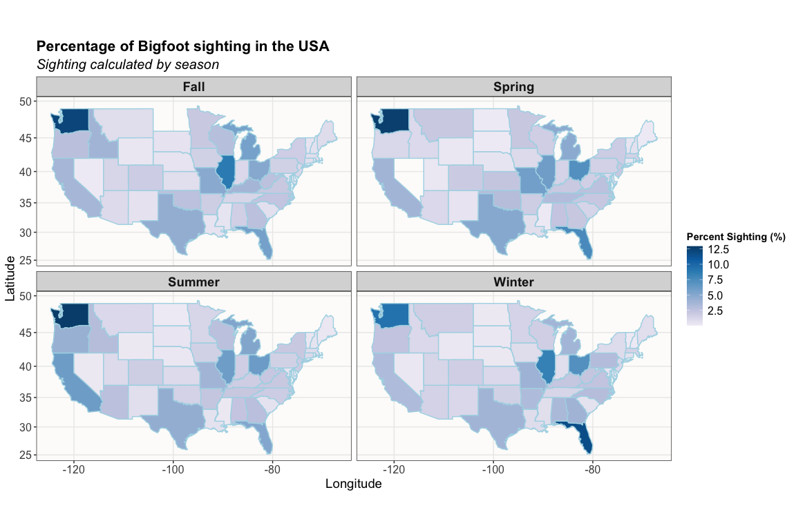
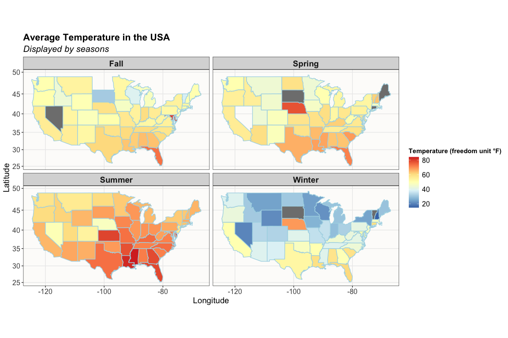
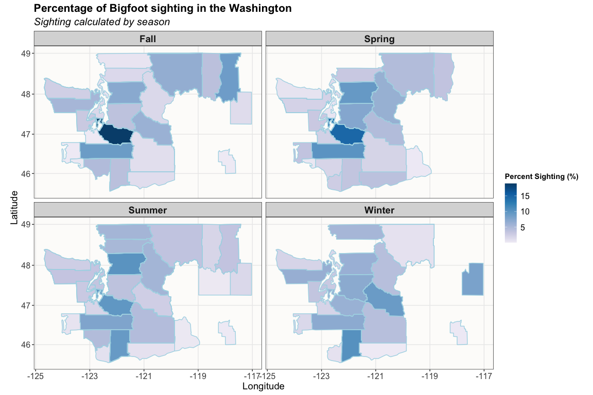

Week 07 Homework
================
Keanu Rochette
2024-10-10

- [Load the Libraries](#load-the-libraries)
- [Loading the data](#loading-the-data)
- [Data Clean Up and Wrangling](#data-clean-up-and-wrangling)
  - [Summarizing the Big Foot data](#summarizing-the-big-foot-data)
  - [Preparing the States data](#preparing-the-states-data)
  - [Joining the dataframes](#joining-the-dataframes)
- [Representing Data on a Map](#representing-data-on-a-map)
  - [Plotting the Big Foot Sighting](#plotting-the-big-foot-sighting)
  - [Effect on Temperature on Big Foot
    Sighting](#effect-on-temperature-on-big-foot-sighting)
  - [Conclusion](#conclusion)
- [Focusing more on Washington
  Sighting](#focusing-more-on-washington-sighting)
  - [Prepping the data](#prepping-the-data)
  - [Data Wrangling and Summary](#data-wrangling-and-summary)
  - [Plotting Big Foot Sighting in
    Washington](#plotting-big-foot-sighting-in-washington)
  - [Conclusion](#conclusion-1)

## Load the Libraries

``` r
library(tidyverse) #data manipulation
library(here) # unbreakable paths
library(maps) # obtain map information
library(mapproj) # for map projections
library(mapdata) # obtain map information
library(RColorBrewer) # for color ramps 
```

## Loading the data

The data comes from the Tidy Tuesday Github page.

``` r
#We can access the data with the following line
bigfoot <- readr::read_csv('https://raw.githubusercontent.com/rfordatascience/tidytuesday/master/data/2022/2022-09-13/bigfoot.csv')

# Then we pre-select the columns of interest
bigfoot <- bigfoot %>% select (-observed, -location_details, -title, -summary)

#loading state data
states <- map_data("state")
head (states, 5)
```

    ##        long      lat group order  region subregion
    ## 1 -87.46201 30.38968     1     1 alabama      <NA>
    ## 2 -87.48493 30.37249     1     2 alabama      <NA>
    ## 3 -87.52503 30.37249     1     3 alabama      <NA>
    ## 4 -87.53076 30.33239     1     4 alabama      <NA>
    ## 5 -87.57087 30.32665     1     5 alabama      <NA>

## Data Clean Up and Wrangling

### Summarizing the Big Foot data

We can tidy up the data set.  
We are specifically interested in seeing what state has the highest
percentage of Big Foot sighting by season.  
To do so, we calculated the total number of sights in the country for
each season.  
We also calculated the total number of sighting by states by season.  
This allowed to calculated the percentage of Big Foot sighting by state
by season.

``` r
bigfoot_compact <- bigfoot %>% 
    # Only the 4 seasons were allowed for analysis
  filter(season != "Unknown") %>% 
  group_by(season) %>% 
    #sum of the sighting by season
  mutate(sight_by_season = sum(number, na.rm = T)) %>% 
  ungroup() %>% 
  group_by(state, season) %>% 
  # data summary by county and season
  summarize(rel_sight = sum(number,na.rm = T)/sight_by_season*100,
             avg_temp = mean(temperature_mid, na.rm = T)) %>% 
  distinct() # somehow I had a lot of duplicated in the final table
             # distinct() allows to remove duplicates
head(bigfoot, 5)
```

    ## # A tibble: 5 × 24
    ##   county        state season latitude longitude date       number classification
    ##   <chr>         <chr> <chr>     <dbl>     <dbl> <date>      <dbl> <chr>         
    ## 1 Winston Coun… Alab… Summer     NA        NA   NA          30680 Class B       
    ## 2 Valdez-Chiti… Alas… Fall       NA        NA   NA           1261 Class A       
    ## 3 Washington C… Rhod… Fall       41.4     -71.5 1974-09-20   6496 Class A       
    ## 4 York County   Penn… Summer     NA        NA   NA           8000 Class B       
    ## 5 Yamhill Coun… Oreg… Spring     NA        NA   NA            703 Class B       
    ## # ℹ 16 more variables: geohash <chr>, temperature_high <dbl>,
    ## #   temperature_mid <dbl>, temperature_low <dbl>, dew_point <dbl>,
    ## #   humidity <dbl>, cloud_cover <dbl>, moon_phase <dbl>,
    ## #   precip_intensity <dbl>, precip_probability <dbl>, precip_type <chr>,
    ## #   pressure <dbl>, uv_index <dbl>, visibility <dbl>, wind_bearing <dbl>,
    ## #   wind_speed <dbl>

To better join the dataframes, they must have the same column header and
the same data value options.  
We therefore have to make the state names all lowercase to join them

``` r
bigfoot_compact <- bigfoot_compact %>% 
  mutate(state = tolower(state))
```

### Preparing the States data

Selecting only the data that we need and renaming “region” as “state”
for future operations

``` r
states <- states %>% 
  select (long, lat, state = region, group) 
head(states, 5)
```

    ##        long      lat   state group
    ## 1 -87.46201 30.38968 alabama     1
    ## 2 -87.48493 30.37249 alabama     1
    ## 3 -87.52503 30.37249 alabama     1
    ## 4 -87.53076 30.33239 alabama     1
    ## 5 -87.57087 30.32665 alabama     1

### Joining the dataframes

Left join is chosen so that the bigfoot df is prioritized and the state
information get added to the existing rows of the bigfoot df.

``` r
bigfoot_state<- left_join(bigfoot_compact, states)

head(bigfoot, 5)
```

    ## # A tibble: 5 × 24
    ##   county        state season latitude longitude date       number classification
    ##   <chr>         <chr> <chr>     <dbl>     <dbl> <date>      <dbl> <chr>         
    ## 1 Winston Coun… Alab… Summer     NA        NA   NA          30680 Class B       
    ## 2 Valdez-Chiti… Alas… Fall       NA        NA   NA           1261 Class A       
    ## 3 Washington C… Rhod… Fall       41.4     -71.5 1974-09-20   6496 Class A       
    ## 4 York County   Penn… Summer     NA        NA   NA           8000 Class B       
    ## 5 Yamhill Coun… Oreg… Spring     NA        NA   NA            703 Class B       
    ## # ℹ 16 more variables: geohash <chr>, temperature_high <dbl>,
    ## #   temperature_mid <dbl>, temperature_low <dbl>, dew_point <dbl>,
    ## #   humidity <dbl>, cloud_cover <dbl>, moon_phase <dbl>,
    ## #   precip_intensity <dbl>, precip_probability <dbl>, precip_type <chr>,
    ## #   pressure <dbl>, uv_index <dbl>, visibility <dbl>, wind_bearing <dbl>,
    ## #   wind_speed <dbl>

## Representing Data on a Map

### Plotting the Big Foot Sighting

We can plot the percentage of Big Foot sighting using a color ramp.  
Darker colors indicate more sighting of Big Foot.

``` r
ggplot()+
    # geom_polygon allows to plot maps, with light blue state lines
  geom_polygon(data = bigfoot_state, aes(x=long, y=lat, group = group, fill = rel_sight), color = "lightblue")+
    # map projection is mercator because it's straight forward 
  coord_map(projection = "mercator") +
  theme_bw() +
    # keeping the maps tidy by showing them on 2 columns
  facet_wrap(~season, ncol = 2)+
    # pretty labels
  labs(title = "Percentage of Bigfoot sighting in the USA",
       subtitle = "Sighting calculated by season",
       x= "Longitude", y = "Latitude",
       fill = "Percent Sighting (%)") +
    # color brewer 'distiller' option plots continuous values !
  scale_fill_distiller(palette= "PuBu", direction=1) +
    #change theme elements to make the plot nice to look at 
  theme(plot.title = element_text(size=16, face = "bold"), 
        plot.subtitle = element_text(size=15, face = "italic"),
        axis.title = element_text(size = 14),
        axis.text = element_text(size = 12),
        strip.text.x = element_text(size = 14, face = "bold"),
        legend.title = element_text(face = "bold"),
        legend.text = element_text(size = 12),
        panel.background = element_rect(fill = "#FDFCFA")) 
```

<!-- -->

### Effect on Temperature on Big Foot Sighting

Just for fun we can also plot the average temperature across the
country.

``` r
ggplot()+
  geom_polygon(data = bigfoot_state, aes(x=long, y=lat, group = group, fill = avg_temp), color = "lightblue")+
  coord_map(projection = "mercator") +
  theme_bw() +
  facet_wrap(~season, ncol = 2)+
  labs(title = "Average Temperature in the USA",
       subtitle = "Displayed by seasons",
       x= "Longitude", y = "Latitude",
       fill = "Temperature (freedom unit °F)") +
  scale_fill_distiller(palette= "RdYlBu") +
  theme(plot.title = element_text(size=16, face = "bold"), 
        plot.subtitle = element_text(size=15, face = "italic"),
        axis.title = element_text(size = 14),
        axis.text = element_text(size = 12),
        strip.text.x = element_text(size = 14, face = "bold"),
        legend.title = element_text(face = "bold"),
        legend.text = element_text(size = 12),
        panel.background = element_rect(fill = "#FDFCFA"))
```

<!-- -->

### Conclusion

It looks like Big Foot is more commonly sighted in Washington State
throughout the year.  
However, we can observe a **noticeable decrease in Washington** sighting
*during the winter* with an **increase of sighting in Florida**.  
This change may be due to a migratory pattern of Big Foot to warmer
latitudes in the winter.

**Conclusion:** Big Foot migrates from Washington to Florida during the
winter for warmer weather.

## Focusing more on Washington Sighting

### Prepping the data

Out of curiosity we can also look at the Big Foot data by county in the
state of Washington.  
We therefore load the county data and filter the data such that only
Washington counties are kept.  
We also rename the region and subregion column to state and county
respectively for future operation.

``` r
counties <- map_data("county")
WA_counties <- counties %>% 
  filter(region == "washington") %>% 
  rename(state=region, county = subregion)
```

### Data Wrangling and Summary

Just like we did for the USA data, we are looking at the percentage of
Big Foot sighting by season by county in Washington.

``` r
WA_bigfoot <- bigfoot %>%
    #filtering only Washington data and the 4 seasons.
  filter(season != "Unknown", state== "Washington") %>% 
  group_by(season) %>% 
    #sum of the sighting by season 
  mutate(sight_by_season = sum(number, na.rm = T)) %>%
  group_by(county,season) %>% 
    # data summary by county and season
  summarize (rel_sight = sum(number,na.rm = T)/sight_by_season*100,
             avg_temp = mean(temperature_mid, na.rm = T)) %>% 
    #county names should be the same to join so I change them to lowercase
  mutate(county = tolower(county)) %>% 
    # counties have the word "county" in them and i don't need that. 
    # separate the county names from the word "county" for later. 
  separate(col = county, into = c("county", "useless"), sep = " ") %>% 
    # remove the column with the word "county" in its column.
  select(-useless)
```

Joining the Washington Big Foot data with the County data

``` r
WA_joined <- left_join(WA_bigfoot, WA_counties)

head(WA_joined, 5)
```

    ## # A tibble: 5 × 9
    ## # Groups:   season [1]
    ##   county season rel_sight avg_temp  long   lat group order state     
    ##   <chr>  <chr>      <dbl>    <dbl> <dbl> <dbl> <dbl> <int> <chr>     
    ## 1 benton Spring    0.0819      NaN -120.  45.8  2893 85015 washington
    ## 2 benton Spring    0.0819      NaN -120.  46.0  2893 85016 washington
    ## 3 benton Spring    0.0819      NaN -120.  46.2  2893 85017 washington
    ## 4 benton Spring    0.0819      NaN -120.  46.2  2893 85018 washington
    ## 5 benton Spring    0.0819      NaN -120.  46.6  2893 85019 washington

### Plotting Big Foot Sighting in Washington

``` r
ggplot()+
  geom_polygon(data = WA_joined, aes(x=long, y=lat, group = group, fill = rel_sight), color = "lightblue")+
  coord_map(projection = "mercator") +
  theme_bw() +
  facet_wrap(~season, ncol = 2) +
    # pretty labels
  labs(title = "Percentage of Bigfoot sighting in the Washington",
       subtitle = "Sighting calculated by season",
       x= "Longitude", y = "Latitude",
       fill = "Percent Sighting (%)") +
    # color brewer 'distiller' option plots continuous values !
  scale_fill_distiller(palette= "PuBu", direction=1) +
    #change theme elements to make the plot nice to look at 
  theme(plot.title = element_text(size=16, face = "bold"), 
        plot.subtitle = element_text(size=15, face = "italic"),
        axis.title = element_text(size = 14),
        axis.text = element_text(size = 12),
        strip.text.x = element_text(size = 14, face = "bold"),
        legend.title = element_text(face = "bold"),
        legend.text = element_text(size = 12),
        panel.background = element_rect(fill = "#FDFCFA"))
```

<!-- -->

### Conclusion

The Pierce County seem to have the most Big Foot sighting in the Fall
and Spring… *Weird!*
