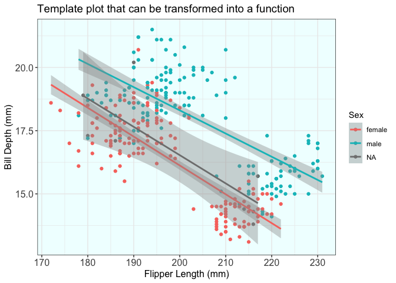
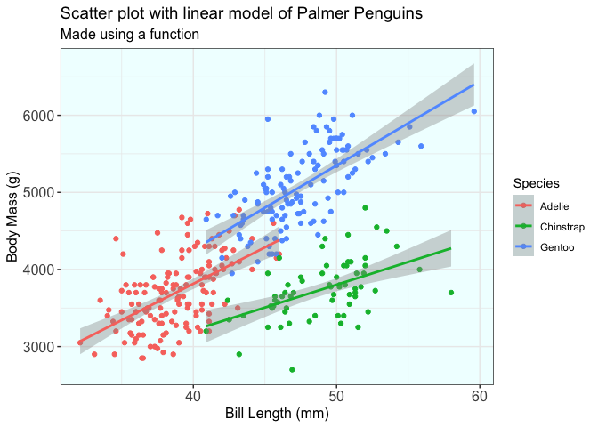
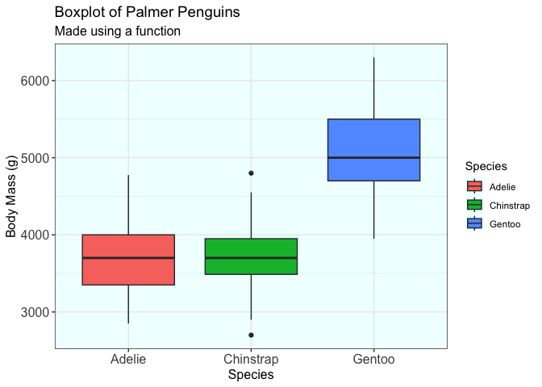
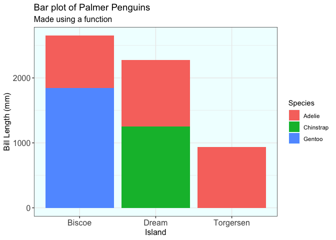

Week 9 - Function Homework
================
Keanu Rochette
2024-10-24

- [Load the libraries](#load-the-libraries)
- [Function for plotting](#function-for-plotting)
  - [Creating the function](#creating-the-function)
  - [Testing the function](#testing-the-function)
- [Summary statistic using a
  function](#summary-statistic-using-a-function)
  - [Creating the function](#creating-the-function-1)
  - [Testing the function](#testing-the-function-1)
- [Fun function: Can’t decide of a movie for your Halloween
  party?](#fun-function-cant-decide-of-a-movie-for-your-halloween-party)
  - [Load data](#load-data)
  - [Creating the function](#creating-the-function-2)
  - [Testing the function](#testing-the-function-2)

## Load the libraries

``` r
library(tidyverse)
library(here)
library(palmerpenguins)
```

## Function for plotting

The goal is to reproduce a plot similar to the one below by using a
function and make it more flexible in less lines of codes.

``` r
ggplot(penguins, aes(x= flipper_length_mm, y=bill_depth_mm, color = sex))+
  geom_point()+
  labs(title = "Template plot that can be transformed into a function",
       x = "Flipper Length (mm)",
       y = "Bill Depth (mm)",
       color = "Sex") + 
  geom_smooth(method = "lm") +
  theme_bw() + 
  theme(plot.title = element_text(size=14), 
        plot.subtitle = element_text(size=12),
        axis.title = element_text(size = 12),
        axis.text = element_text(size = 12),
        strip.text.x = element_text(size = 12),
        plot.caption = element_text(size = 12),
        panel.background = element_rect(fill = "azure1"))
```

<!-- -->

### Creating the function

``` r
testplot <- function(data = penguins, x, y, color, geom_func =geom_point) {
  #creating a function using the penguin dataset, 
  # x and y variables to plot and a color component 
  # geom_func allows to swap the style of the plot
  
if (identical (geom_func, geom_point)) { 
  # identical() allows me to vary the options of graphs I want to plot
  # normal logical operator did not work unfortunately
  # here we can have an scatter plot with a linear regression
  ggplot(data , aes(x= {{x}}, y= {{y}}, color = {{color}})) +
  geom_point() +
  geom_smooth(method = "lm") +
  theme_bw()
  
  #this generates a boxplot with a fill color
} else if (identical (geom_func, geom_boxplot)){
  ggplot(data , aes(x= {{x}}, y= {{y}}, fill = {{color}})) +
  geom_boxplot() +
  theme_bw()

  # this generates a bar plot with fill colors
} else if (identical(geom_func, geom_bar)){
  ggplot(data , aes(x= {{x}}, y= {{y}}, fill = {{color}})) +
  geom_bar(stat= "identity") +
  theme_bw()
  
}
}
```

### Testing the function

#### Plotting a scatter plot

``` r
testplot(x= bill_length_mm, y= body_mass_g, color = species, geom_func = geom_point) +
  labs(title = "Scatter plot with linear model of Palmer Penguins",
       subtitle = "Made using a function",
       x = "Bill Length (mm)",
       y = "Body Mass (g)",
       color = "Species") + 
  theme_bw() + 
  theme(plot.title = element_text(size=14), 
        plot.subtitle = element_text(size=12),
        axis.title = element_text(size = 12),
        axis.text = element_text(size = 12),
        strip.text.x = element_text(size = 12),
        plot.caption = element_text(size = 12),
        panel.background = element_rect(fill = "azure1"))
```

<!-- -->

#### Plotting a box plot

``` r
testplot(x= species, y= body_mass_g, color = species, geom_func = geom_boxplot) +
  labs(title = "Boxplot of Palmer Penguins",
       subtitle = "Made using a function",
       x = "Species",
       y = "Body Mass (g)",
       fill = "Species") + 
  theme_bw() + 
  theme(plot.title = element_text(size=14), 
        plot.subtitle = element_text(size=12),
        axis.title = element_text(size = 12),
        axis.text = element_text(size = 12),
        strip.text.x = element_text(size = 12),
        plot.caption = element_text(size = 12),
        panel.background = element_rect(fill = "azure1"))
```

<!-- -->

#### Plotting a bar plot

``` r
testplot(x= island, y= bill_depth_mm, color = species, geom_func = geom_bar)+
  labs(title = "Bar plot of Palmer Penguins",
       subtitle = "Made using a function",
       x = "Island",
       y = "Bill Length (mm)",
       fill = "Species") + 
  theme_bw() + 
  theme(plot.title = element_text(size=14), 
        plot.subtitle = element_text(size=12),
        axis.title = element_text(size = 12),
        axis.text = element_text(size = 12),
        strip.text.x = element_text(size = 12),
        plot.caption = element_text(size = 12),
        panel.background = element_rect(fill = "azure1"))
```

<!-- -->

## Summary statistic using a function

The goal is to recreate a summary table like the following by using a
function.

``` r
penguins %>% 
  group_by(year) %>% 
  summarize(avg= mean(bill_length_mm, na.rm = T),
            med = median(bill_length_mm, na.rm = T),
            std_dev= sd(bill_length_mm, na.rm = T),
            min = min(bill_depth_mm, na.rm = T),
            max = max(bill_depth_mm, na.rm = T))
```

    ## # A tibble: 3 × 6
    ##    year   avg   med std_dev   min   max
    ##   <int> <dbl> <dbl>   <dbl> <dbl> <dbl>
    ## 1  2007  43.7  44.1    5.39  13.1  21.5
    ## 2  2008  43.5  43.9    5.34  13.3  21.1
    ## 3  2009  44.5  44.9    5.64  13.7  20.7

### Creating the function

``` r
summary_stat<- function (data = penguins, group=island, variable = variable ){
  data %>% 
    #we are adding an option to group the data in categories 
  group_by({{group}}) %>% 
    # for this summary stat we want the average, median, standard deviation, min and max values
  summarize(avg= mean({{variable}}, na.rm = T),
            med = median({{variable}}, na.rm = T),
            std_dev= sd({{variable}}, na.rm = T),
            min = min({{variable}}, na.rm = T),
            max = max({{variable}}, na.rm = T))
}
```

### Testing the function

#### Example 1: just selecting the variable argument

``` r
summary_stat(variable = bill_depth_mm)
```

    ## # A tibble: 3 × 6
    ##   island      avg   med std_dev   min   max
    ##   <fct>     <dbl> <dbl>   <dbl> <dbl> <dbl>
    ## 1 Biscoe     15.9  15.5    1.82  13.1  21.1
    ## 2 Dream      18.3  18.4    1.13  15.5  21.2
    ## 3 Torgersen  18.4  18.4    1.34  15.9  21.5

#### Example 2: changing the groups

``` r
summary_stat(group = year, variable = flipper_length_mm)
```

    ## # A tibble: 3 × 6
    ##    year   avg   med std_dev   min   max
    ##   <int> <dbl> <dbl>   <dbl> <int> <int>
    ## 1  2007  197.   195    13.9   172   230
    ## 2  2008  203.   200    13.9   178   231
    ## 3  2009  203.   199    13.7   176   230

## Fun function: Can’t decide of a movie for your Halloween party?

It can be difficult to select a movie due to the massive amount of
choice that exist on the internet.  
This function will help by generating a movie choice at random.

### Load data

Data downloaded from Kaggle.

There are a total of 836 movie options.

``` r
horror_movie <- read_csv(here("Week_09", "data", "Horror_Movie_IMDb.csv"))
```

### Creating the function

For this function, the user has the choice to narrow their choice of
movie based on:

- year: the movie selected will be no older than the year specified.
- run time: the movie selected will be no longer than the run time
  specified.
- rating: the rating of the movie selected will be no lower than the
  rating specified.

``` r
movie_idea<- function(year= 1920, runtime = 192, rating = 1) {
  
movie_info <- horror_movie %>% 
    filter(`Movie Year` > {{year}} & Runtime < {{runtime}}, Rating > {{rating}}) %>% 
    mutate(ID_num = seq(1,length(`Movie Title`), by =1)) %>% 
    filter (ID_num == sample(1:length(`Movie Title`),1))
    
return(movie_info)
}
```

### Testing the function

#### Example 1: more recent movie with high rating

We want a move that is no older than 2015 with a rating greater than 7

``` r
movie_idea(year = 2015, rating = 8)
```

    ## # A tibble: 1 × 9
    ##   `Movie Title` `Movie Year` Runtime Genre    Rating Director Votes Gross ID_num
    ##   <chr>                <dbl>   <dbl> <chr>     <dbl> <chr>    <dbl> <chr>  <dbl>
    ## 1 Tumbbad               2018     104 Drama, …    8.2 Rahi An… 53297 <NA>       1

#### Example 2: Feeling like a shorter movie, medium rating is acceptable

``` r
movie_idea(runtime = 60 , rating = 5)
```

    ## # A tibble: 1 × 9
    ##   `Movie Title` `Movie Year` Runtime Genre    Rating Director Votes Gross ID_num
    ##   <chr>                <dbl>   <dbl> <chr>     <dbl> <chr>    <dbl> <chr>  <dbl>
    ## 1 Host II               2020      57 Horror,…    6.5 Rob Sav… 34122 <NA>       1

#### Example 3: playing a movie in the background, knowing nobody will be watching it

``` r
movie_idea(runtime = 200 , rating = 1)
```

    ## # A tibble: 1 × 9
    ##   `Movie Title` `Movie Year` Runtime Genre    Rating Director Votes Gross ID_num
    ##   <chr>                <dbl>   <dbl> <chr>     <dbl> <chr>    <dbl> <chr>  <dbl>
    ## 1 Species               1995     108 Action,…    5.8 Roger D… 82499 $60.…    556
