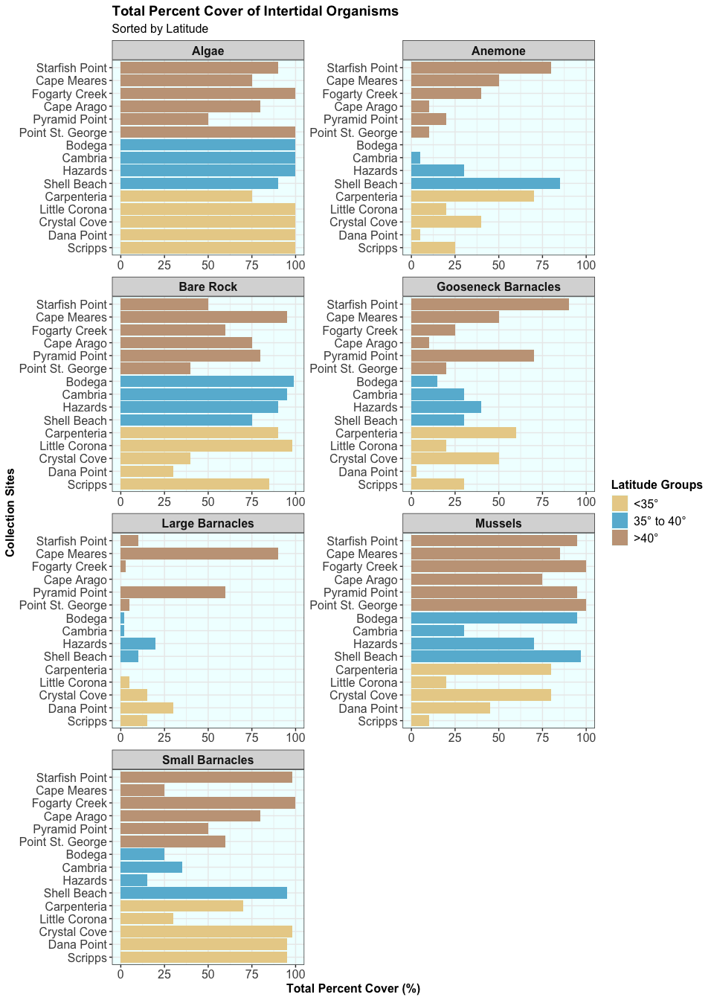

Week 9 - Homework Factors
================
Keanu Rochette
2024-10-27

- [Load Libraries](#load-libraries)
- [Cleaning the data](#cleaning-the-data)
- [Joining the datasets](#joining-the-datasets)
- [Pivotting the dataframe](#pivotting-the-dataframe)
- [Making a plot](#making-a-plot)
- [Practice Plot](#practice-plot)

## Load Libraries

``` r
library(tidyverse)
library(here)
library(ghibli)
library(RColorBrewer)
library(gganimate)
```

\#Load the Data

``` r
intertidal <- read_csv(here("Week_09", "data", "intertidaldata.csv" ))
intertidal_lat <- read_csv(here("Week_09", "data", "intertidaldata_latitude.csv" ))
```

## Cleaning the data

In the quadrat column, some of the data is not clean and we have to
remove the random periods, “1” and blank spaces.

``` r
intertidal <- intertidal %>% 
  mutate(Quadrat= str_replace_all(Quadrat, pattern="\\.",
                                  replacement = "")) %>% 
  mutate(Quadrat= str_replace_all(Quadrat, pattern="1",
                                  replacement = "")) %>% 
  mutate(Quadrat = str_trim(Quadrat))
```

## Joining the datasets

``` r
tidal_data <- left_join(intertidal, intertidal_lat, by = "Site")
```

## Pivotting the dataframe

``` r
tidal_data <- tidal_data %>% 
  # removing the organisms that are evaluated as counts, the scale is different to the rest.
  select(-c(11:13)) %>% 
  #pivoting so that all the organisms are in one column
  pivot_longer(cols = c(4:10),
               names_to = "Organism",
               values_to = "Abundance") %>% 
  # remove potential blank spaces in the organisms column
  mutate(Organism = str_trim(Organism)) %>% 
  relocate(Latitude, .after = Site) %>% 
  # order the sites based on their latitudes
  mutate(Site = factor(Site),
         Site = fct_reorder(Site, Latitude)) %>% 
  # there are too many sites to site my color scales.
  # I decided to split it in 3 different regions.
  mutate(Region= ifelse(Latitude <35, "<35°",
                        ifelse(Latitude > 40, ">40°",
                               "35° to 40°"))) %>% 
  relocate(Region, .after = Latitude)

tibble(tidal_data)
```

    ## # A tibble: 3,150 × 7
    ##    Site    Latitude Region Transect Quadrat Organism            Abundance
    ##    <fct>      <dbl> <chr>     <dbl> <chr>   <chr>                   <dbl>
    ##  1 Scripps     32.9 <35°          1 Low     Bare Rock                  25
    ##  2 Scripps     32.9 <35°          1 Low     Algae                      75
    ##  3 Scripps     32.9 <35°          1 Low     Mussels                     0
    ##  4 Scripps     32.9 <35°          1 Low     Small Barnacles             2
    ##  5 Scripps     32.9 <35°          1 Low     Large Barnacles             5
    ##  6 Scripps     32.9 <35°          1 Low     Gooseneck Barnacles         0
    ##  7 Scripps     32.9 <35°          1 Low     Anemone                     3
    ##  8 Scripps     32.9 <35°          1 Mid     Bare Rock                  50
    ##  9 Scripps     32.9 <35°          1 Mid     Algae                       0
    ## 10 Scripps     32.9 <35°          1 Mid     Mussels                     5
    ## # ℹ 3,140 more rows

## Making a plot

``` r
tidal_data %>% 
  # order the "regions as factors based on the latitudes.
  mutate(Region = fct_reorder(Region, Latitude)) %>% 
  ggplot() + 
  # making a bar plot 
  geom_bar(aes(Abundance , Site, fill = Region), stat = "identity", position = "dodge")+
  # facet the graph by organims
  facet_wrap(~Organism, ncol = 2, scale = "free") +
  # defining the x-axis limits
  xlim(0,100)+
  labs(title = "Total Percent Cover of Intertidal Organisms ",
       subtitle = "Sorted by Latitude",
       x = "Total Percent Cover (%)",
       y = "Collection Sites",
       fill = "Latitude Groups") + 
  theme_bw() + 
  theme(plot.title = element_text(size=14, face = "bold"), 
        plot.subtitle = element_text(size=12),
        axis.title = element_text(size = 12, face = "bold"),
        axis.text = element_text(size = 12),
        strip.text.x = element_text(size = 12, face = "bold"),
        legend.title=element_text(size=12, face = "bold"),
        legend.text=element_text(size=12),
        panel.background = element_rect(fill = "azure1"))+
  #custom the colors 
  scale_fill_ghibli_d("MarnieMedium1", direction = -1)
```

<!-- -->

## Practice Plot

Just to try it out, I wanted to make an animated plot

``` r
tidal_data %>% 
  mutate(Region = fct_reorder(Region, Latitude)) %>% 
  ggplot() + 
  # creating a heat map between organisms, collection sites and the %cover
  geom_tile(aes(x=Organism, y = Site, fill= Abundance)) +
  # The heat map will change based on the tide levels
  transition_states(
     Quadrat, # what are we animating by
     transition_length = 2, #The relative length of the transition.
     state_length = 3 # The length of the pause between transitions
   ) +
  labs(title = "Total Percent Cover of Intertidal Organisms ",
       subtitle = "Tide: {closest_state}",
       x = "Benthic Organims",
       y = "Collection Sites",
       fill = "Percent Cover (%)") + 
  theme_bw() + 
  theme(plot.title = element_text(size=14, face = "bold"), 
        plot.subtitle = element_text(size=12),
        axis.title = element_text(size = 12, face = "bold"),
        axis.text = element_text(size = 12),
        strip.text.x = element_text(size = 12, face = "bold"),
        legend.title=element_text(size=12, face = "bold"),
        legend.text=element_text(size=12),
        axis.text.x = element_text(angle= 45, hjust= 1),
        panel.background = element_rect(fill = "azure1"))+
  #custom the colors 
  scale_fill_distiller(palette = "RdYlBu")
```

<!-- -->
